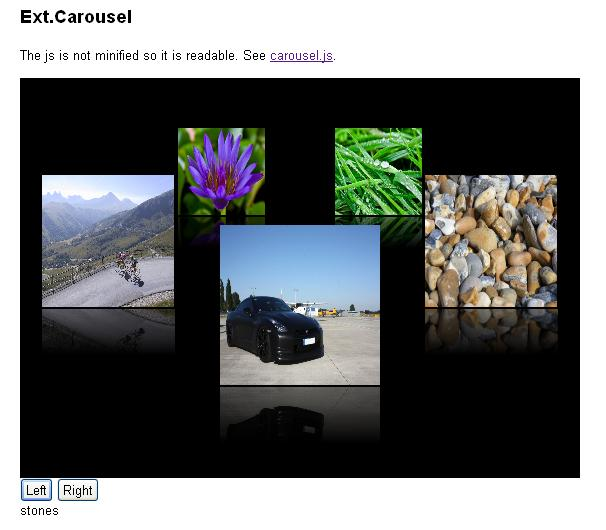

Ext js Carousel
===============
This component is not a scrolling classic carousel. This carousel moves following the shape of an ellipse.
Each Image in this carousel has a reflection and a tooltip.

This component is inspired by a jquery component called : [CloudCarousel 1.0.5](http://www.professorcloud.com).

The codebase of this carousel is based on Ext JS 4.0.7. 

Example
-------
Here is an example using the Carousel extension.

HTML mark-up :

```
    <div id="carousel-div"></div>
	
	<!-- Define left and right buttons. -->
	<input id="left-but"  type="button" value="Left" />
	<input id="right-but" type="button" value="Right" />

	<!-- Define elements to accept the alt and title text from the images. -->
	<p id="title-text"></p>
	<p id="alt-text"></p>
```

The style
```
.carousel-div {
    width:560px; 
    height:400px; 
    background:#000; 
}
```

The applied model :
```
Ext.define('Carousel',{ 
    extend: 'Ext.data.Model',
    fields: [ 
                { name: 'imageSrc', type: 'string' },
                { name: 'title', type: 'string' },
                { name: 'alt', type: 'string' }
             ] 
});
```

The store :
```
Ext.define('Ext.store.Carousel', { 
    extend: 'Ext.data.Store',
    model: 'Carousel', 
    data: [
            { imageSrc:"images/avus_gtr.jpg", title:"avus", alt: "avus" },
            { imageSrc:"images/CroixDeFer.jpg", title:"CroixDeFer", alt: "CroixDeFer" },
            { imageSrc:"images/flower.jpg", title:"flower", alt: "flower" },
            { imageSrc:"images/grass.jpg", title:"grass", alt: "grass" },
            { imageSrc:"images/stones.jpg", title:"stones", alt: "stones" } 
          ] 
});
```

Configuration options for the carousel :
```
Ext.onReady(function() { 
    Ext.createWidget('carousel',{ 
        id: 'carousel-id', 
        xPos: 280, 
        yPos: 80, 
        FPS: 30, 
        reflHeight: 56, 
        reflGap:2, 
        buttonLeft: 'left-but', 
        buttonRight: 'right-but', 
        altBox: 'alt-text', 
        titleBox: 'title-text', 
        autoRotate: 'no', 
        renderTo: 'carousel-div' 
    }); 
});
```

The output would be like the photo below :



Configuration
-------------

The table below contains the different available config options that you can apply on the component :

|Parameter|Description|Default Value| 
|:------------|:--------------|:----------------| 
|minScale |The minimum scale applied to the furthest item. The item at the front has a scale of 1. To make items in the distance one quarter of the size, minScale would be 0.25.|0.5 | 
|reflHeight |Height of the auto-reflection in pixels, assuming applied to the item at the front. The reflection will scale automatically. A value of 0 means that no auto-reflection will appear.|0 | 
|reflGap |Amount of vertical space in pixels between image and reflection, assuming applied to the item at the front. Gap will scale automatically.|0 | 
|reflOpacity |Specifies how transparent the reflection is. 0 is invisible, 1 is totally opaque.|0.5 | 
|xRadius |Half-width of the circle that items travel around.|Width of container / 2.3| 
|yRadius |Half-height of the circle that items travel around.|Height of container / 6| 
|xPos |Horizontal position of the circle centre relative to the container. You would normally set this to half the width of the container.|0 | 
|yPos |Vertical position of the circle centre relative to the container. You would normally set this to around half the height of container.|0 | 
|buttonLeft |A reference to the element that will serve as the 'rotate left' button. The button doesn't have to be within the container.|null | 
|buttonRight |A reference to the element that will serve as the 'rotate right' button. The button doesn't have to be within the container.|null | 
|titleBox |A reference to the element that will display an image's title attribute when hovered over. This element does not have to be within the container.|null | 
|altBox |A reference to the element that will display an image's alt attribute when hovered over. This element does not have to be within the container.|null | 
|FPS |This is the approximate frame rate of the carousel in frames per second. The higher the number, the faster and smoother the carousel movement will appear. However, frame rates that are too high can make the user's browser feel sluggish, especially if they have an under powered machine. The default setting of 30 is a good trade off between speed and performance.|30 | 
|speed |This value represents the speed at which the carousel rotates between items. Good values are around 0.1 ~ 0.3. A value of one will instantly move from one item to the next without any rotation animation. Values should be greater than zero and less than one.|0.2 | 
|autoRotate |Turn on auto-rotation of the carousel using either 'left' or 'right' as the value. The carousel will rotate between items automatically. The auto-rotation stops when the user hovers over the carousel area, and starts again when the mouse is moved off.|'no' | 
|autoRotateDelay|Delay in milliseconds between each rotation in auto-rotate mode. A minimum value of 1000 (i.e. one second) is recommended.|150 | 
|store |Loads the images for the carousel component. The model must have as attributes the source, title and alt for the image.|null |

Further Resources
-----------------
For further information you would like to check these links :

* [CloudCarousel 1.0.5](http://www.professorcloud.com/mainsite/carousel.htm)
* [Ext JS 4.0.7](http://docs.sencha.com/extjs/4.0.7/#!/api/Ext)